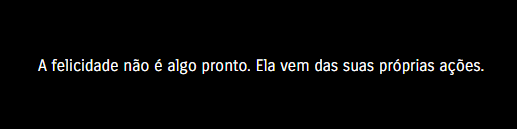

<h1 align="center">Frase do Dia📜</h1> 

<div align="center"> </div>

Este é um projeto simples que visa fornecer uma dose diária de motivação através de mensagens inspiradoras. O site "Frase do Dia" exibe uma única mensagem motivacional a cada dia, ajudando os usuários a começarem o dia com positividade e inspiração.

## Como Funciona

O site é projetado de maneira minimalista e fácil de usar. Ao acessar o site, os usuários verão automaticamente a "Frase do Dia" exibida no centro da página. A mensagem é cuidadosamente selecionada para proporcionar um impulso positivo.

## Estrutura do Projeto

O projeto é composto pelos seguintes arquivos e diretórios:

- **index.html**: Contém a estrutura básica da página web.
- **css/**: Diretório que armazena os arquivos de estilo para a aparência visual do site.
- **js/**: Diretório que contém os scripts JavaScript para a lógica de exibição da frase diária.

## Contribuição

Sinta-se à vontade para contribuir com novas mensagens motivacionais, melhorias de design ou correções de bugs. Para contribuir, siga estes passos:

1. Faça um fork do repositório.
2. Clone o repositório forked para o seu ambiente local.
3. Crie uma nova branch para a sua contribuição (`git checkout -b sua-nova-feature`).
4. Faça as alterações desejadas.
5. Faça commit das alterações (`git commit -m 'Adiciona nova mensagem motivacional'`).
6. Envie as alterações para o seu fork (`git push origin sua-nova-feature`).
7. Crie um pull request para revisão.

<h2 align="center">Capyview é desenvolvido por <a href='https://github.com/danieldemac'>Daniel Cabral</a>.</h2>

## Instalação

1. Crie um clone repository na sua máquina local:

```bash
git clone https://github.com/danieldemac/fraseDoDia.git
